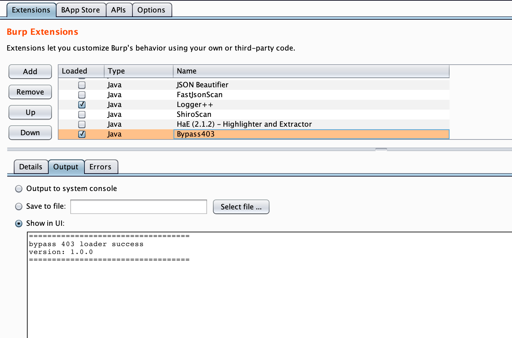
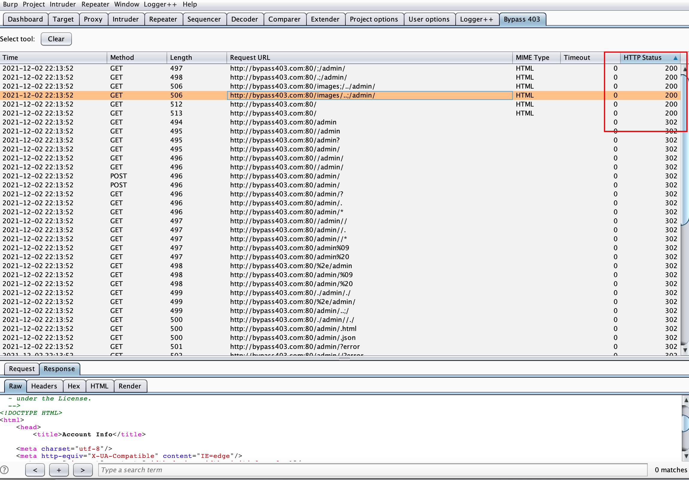

# AutoBypass403-BurpSuite
A burpsuite plugin help me automatic bypass 403.

## How to Run ##

1. Download Bypass.jar

2. Burpsuite Extender add Bypass.jar

   

3. Select the request, right click "send to bypass 403"

   

4. Select the plug-in table and analyze the results

   

   

## Thanks

*  https://github.com/iamj0ker/bypass-403
