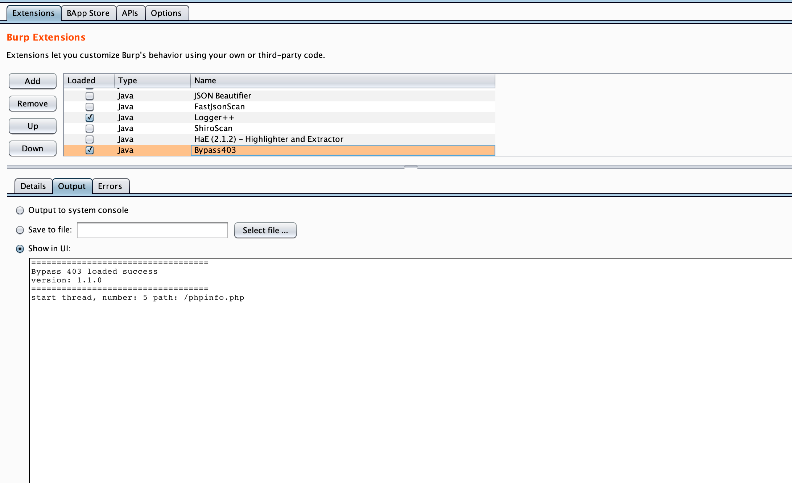
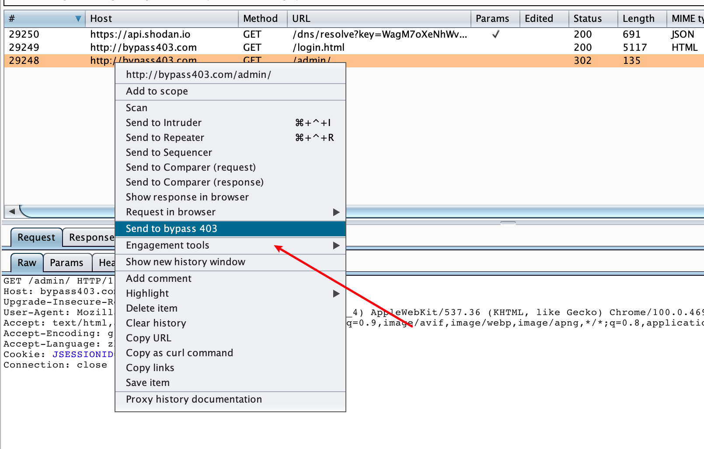

# AutoBypass403-BurpSuite
一个自动化bypass 403/auth的Burpsuite插件

申明：该工具只用于安全自测，禁止用于非法用途

## ChangeLog

#### 2022-06-28

* 修改fuzz逻辑,对每一级路径进行全覆盖

#### 2021-12-05

* 支持多选发送到插件
* 增加多个规则 @Laura_小狮子
* 增加请求数量、结束数量的展示
* 增加相似度匹配(from @pmiaowu HostCollision); 如果返回结果相似度很高，则不展示

#### 2021-12-04

* 增加多线程

#### 2021-12-02 

- 第一次发布

## How to Run ##

1. 下载 Bypass.jar

2. Burpsuite Extender add Bypass.jar

   

   

3. 选择目标请求, 右键点击 "send to bypass 403"

   

4. 选择Bypass 403 table，查看结果

   

   

## Thanks

*  https://github.com/iamj0ker/bypass-403
